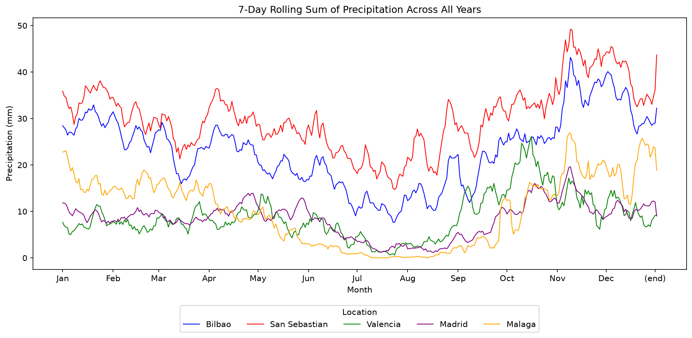
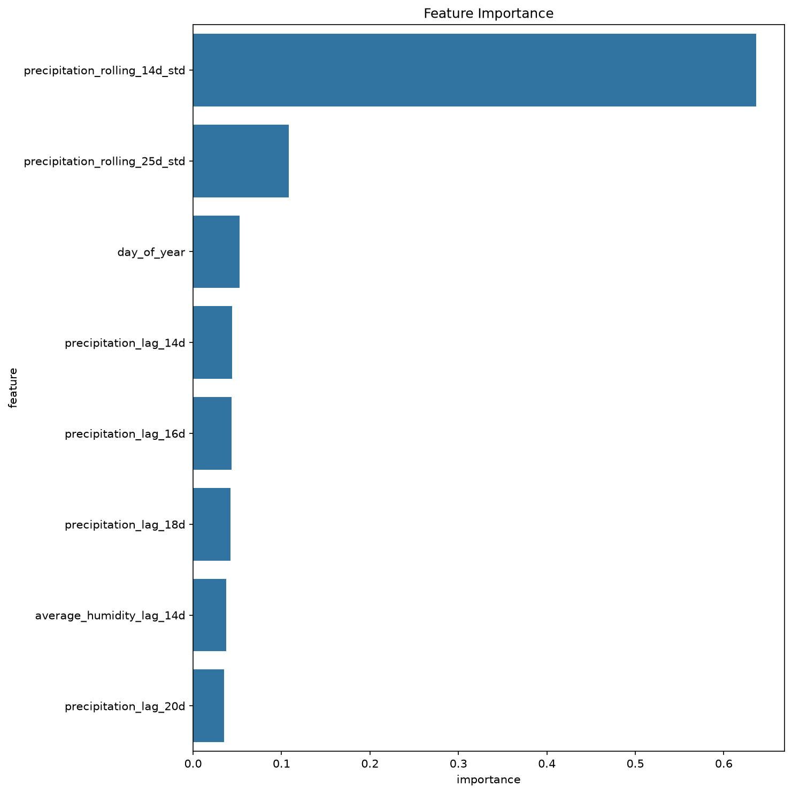
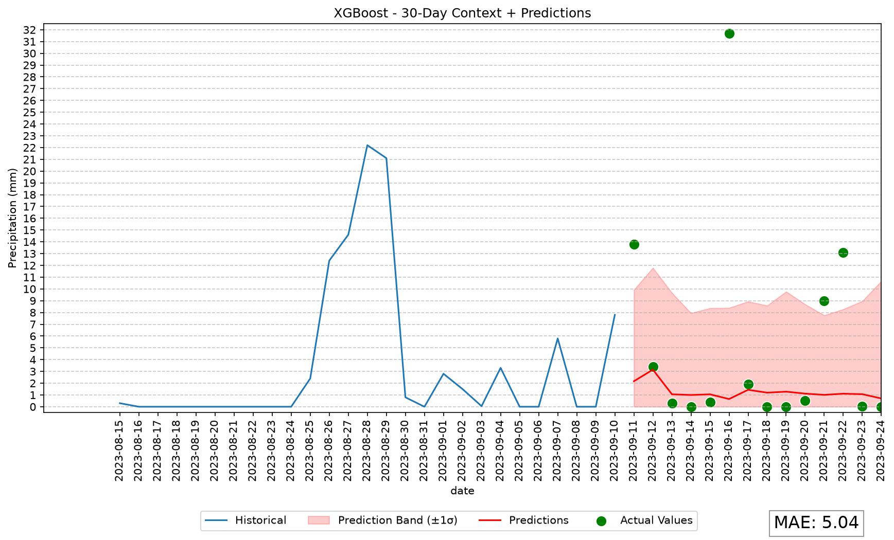

# Precipitation Predictor

Short-term precipitation forecasting for Spanish cities using historical climate data from [AEMET Open Data](https://opendata.aemet.es/centrodedescargas/inicio). This repository implements feature engineering, gradient-boosting models, and expanding-window validation for daily precipitation forecasts up to 14 days ahead.

The system studies rainfall patterns, engineers temporal features, and trains gradient-boosting models to predict daily precipitation up to 14 days ahead. Bilbao is the primary study area thanks to continuous records since 1949 and a pronounced precipitation regime.

## Key results

Expanding-window cross-validation (train through year *N*, predict year *N+1*) on Bilbao historical data:

| Model | Time (min) | MAE ± std (mm) | Notes |
|-------|------------|----------------|-------|
| **XGBoost** | 15 | **3.83 ± 0.47** | Best precision/speed balance (selected) |
| LightGBM | 44 | 4.19 ± 0.71 | Second most accurate |
| LSTM | 138 | 4.46 ± 0.45 | Flatter predictions |
| Prophet | 60 | 4.46 ± 0.48 | Better for long-term trends |

XGBoost was selected for production use: acceptable accuracy, 14-day forecasts in seconds, and viable on resource-constrained hardware.

## Methodology (summary)

- **Data**: AEMET daily climate JSON for Bilbao (and seasonal comparison cities: Madrid, Málaga, Valencia, San Sebastián). Raw files are downloaded from AEMET Open Data (see [Getting started](#getting-started)).
- **Horizon**: 14-day ahead daily precipitation.
- **Features**: lag precipitation (14, 16, 18, 20 days), lag humidity (14 days), rolling precipitation std (14, 25 days), day-of-year.
- **Validation**: expanding-window cross-validation; MAE and custom rain-error metric.
- **Exogenous variables tested and discarded**: ENSO index, nearby-station precipitation (San Sebastián).

Rolling precipitation standard deviation and day-of-year are the most important predictors, confirming that recent variability and seasonality drive short-term forecasts.

See [docs/methodology.md](docs/methodology.md) for the full methodology.

## Sample outputs

Charts and metrics live under `results/` and are checked into the repo. Re-run `./scripts/predict_bilbao.sh`, `./scripts/export_bilbao_model.sh`, `./scripts/predict_bilbao_from_model.sh`, `./scripts/visualize_seasonality.sh`, or `./scripts/benchmark.sh` to refresh them after code or data changes.

### Multi-city seasonality

Seven-day rolling precipitation sums across Bilbao, San Sebastián, Valencia, Madrid, and Málaga — wet Atlantic north vs dry Mediterranean south, with autumn peaks on the Cantabrian coast.



### Feature importances (XGBoost)

Rolling precipitation variability dominates; lag features and day-of-year contribute smaller but non-zero signal.



### 14-day forecast example

Forecast from 2023-09-11 after a wet late-August spell: the model tracks low baseline rain but under-predicts sharp September spikes (MAE 5.04 mm for this window).



### All artifacts

| Description | Path |
|-------------|------|
| Bilbao metrics | `results/bilbao/metrics.txt` |
| 14-day forecast | `results/bilbao/{date}-precipitation.png` |
| Categorized levels | `results/bilbao/{date}-levels.png` |
| Feature importances (XGBoost) | `results/bilbao/{date}-feature-importance.png` |
| Exported XGBoost bundle | `results/bilbao/models/{max_date}/` (`model.ubj` + `manifest.json`) |
| Forecast from exported model | `results/bilbao/{date}-metrics-from-model.txt` (when ground truth exists) |
| Seasonal 7-day rolling sum | `results/seasonality/7d-rolling-sum-prec.png` |
| Cross-validation benchmark | `results/benchmark/output.txt` |

## Getting started

**Requirements**: Python 3.13+, [pyenv](https://github.com/pyenv/pyenv) recommended.

```bash
# Clone and enter the repo
cd precipitation_predictor

# Python version (pyenv)
pyenv install -s 3.13
pyenv local 3.13

# Virtual environment
python -m venv .venv
source .venv/bin/activate

# Install package + dev tools
pip install -e ".[dev]"

# AEMET API key (required only to refresh raw data)
cp .env.example .env   # then set AEMET_API_KEY in .env

# Run Bilbao predictions (XGBoost, sample dates; trains in memory each run)
./scripts/predict_bilbao.sh

# Export a trained model bundle (XGBoost .ubj + manifest)
./scripts/export_bilbao_model.sh                              # full history → models/{max_date}/
./scripts/export_bilbao_model.sh --prediction-date 2023-09-11  # train through day before

# Forecast from an exported bundle (no retraining)
./scripts/predict_bilbao_from_model.sh --model-dir results/bilbao/models/2025-02-25

# Multi-city seasonality chart
./scripts/visualize_seasonality.sh

# Cross-validation benchmark (long-running)
./scripts/benchmark.sh

# Optional: fetch new AEMET JSON (example: extend Málaga shard 8; also upserts SQLite)
./scripts/extract_aemet_data.sh --city malaga --start 2020-04-20 --shard 8
```

Climate data ships in two forms under `data/`:

- **`data/**/*.json`** — AEMET JSON shards (source of truth, version-controlled).
- **`data/climate.sqlite`** — SQLite copy of those records (also version-controlled) so scripts can query by station and date range without parsing every JSON file on each run.

After clone, you can run predictions and exported-model inference immediately; no import step is required. Rebuild the database only when JSON changes:

```bash
./scripts/import_climate_db.sh   # re-import all JSON → climate.sqlite
```

`./scripts/extract_aemet_data.sh` writes JSON and upserts into SQLite in one step.

## Climate data (SQLite)

Historical records are queried at runtime from **`data/climate.sqlite`**. That file is **checked into the repo** and is generated from the AEMET JSON shards in `data/` (same station/day records; JSON remains the canonical export format for reference and diffs).

| When | Command |
|------|---------|
| Fresh clone | Use committed `data/climate.sqlite` as-is |
| After editing or adding JSON under `data/` | `./scripts/import_climate_db.sh` |
| After fetching from AEMET API | `./scripts/extract_aemet_data.sh ...` (JSON + SQLite upsert) |

**Training / export / benchmark** load the full Bilbao series from SQLite. **Inference from an exported model** loads only a trailing window (~51 days of history plus the 14-day evaluation horizon) — enough for lag/rolling features without reading 75 years of rows.

Schema: one row per `(station idema, fecha)` with the raw AEMET record stored as JSON.

## Exported model (train once, forecast separately)

The production XGBoost booster can be saved and loaded without retraining. Each bundle is a directory with:

| File | Purpose |
|------|---------|
| `model.ubj` | Trained XGBoost booster (native binary JSON) |
| `manifest.json` | Training cutoff (`max_date`), feature column order, horizon, seed |

**Current full-history model** (trained through the last available Bilbao record):

`results/bilbao/models/2025-02-25/`

Forecast the next 14 days from that cutoff (2025-02-26 through 2025-03-11):

```bash
./scripts/predict_bilbao_from_model.sh --model-dir results/bilbao/models/2025-02-25
```

Charts are written to `results/bilbao/` with the **first forecast day** as the filename prefix (e.g. `2025-02-26-precipitation.png`). The model directory name is the **last training day** (`max_date`).

### Export options

```bash
# Train on all available data; output defaults to results/bilbao/models/{max_date}/
./scripts/export_bilbao_model.sh

# Train through a specific cutoff (max_date = prediction_date − 1 day)
./scripts/export_bilbao_model.sh --prediction-date 2023-09-11
# → results/bilbao/models/2023-09-10/
```

If you refresh data after exporting, re-run import (if needed) and export when you want an updated booster trained through the new last day.

### Bundled models in the repo

| Bundle | `max_date` | Use case |
|--------|------------|----------|
| `results/bilbao/models/2023-09-11/` | 2023-09-10 | Past-date evaluation (MAE 5.04 mm vs ground truth) |
| `results/bilbao/models/2025-02-25/` | 2025-02-25 | Current full-history production model (forward forecast) |

```bash
# Past window with known outcomes (metrics printed)
./scripts/predict_bilbao_from_model.sh --model-dir results/bilbao/models/2023-09-11

# Forward forecast from latest data (charts only if no future ground truth)
./scripts/predict_bilbao_from_model.sh --model-dir results/bilbao/models/2025-02-25
```

## Project structure

```
precipitation_predictor/
├── src/precipitation_predictor/   # Application package
│   ├── config.py                  # Shared paths, features, dates
│   ├── predict_bilbao.py          # Bilbao forecast demo (train in memory)
│   ├── export_bilbao_model.py     # Train and export XGBoost bundle
│   ├── predict_bilbao_from_model.py  # Forecast from exported bundle
│   ├── visualize_seasonality.py   # Multi-city seasonality chart
│   ├── benchmark.py               # Cross-validation benchmark
│   ├── extract_aemet_data.py      # Fetch raw AEMET JSON into data/
│   ├── import_climate_db.py       # Import JSON shards into SQLite
│   ├── internal/                  # Core library modules
│   │   ├── climate_db.py          # SQLite storage and station queries
│   │   ├── process_data.py        # AEMET record cleaning & features
│   │   ├── prediction.py          # Training & evaluation orchestration
│   │   └── custom_metrics.py      # Rain-error metrics
│   ├── models/                    # XGBoost wrapper, model bundle I/O
│   └── utils/                     # Plotting, CV benchmark & config exploration helpers
│       ├── benchmark_utils.py     # Expanding-window cross-validation
│       └── config_exploration.py  # Random feature/config search (ad-hoc)
├── scripts/
│   ├── predict_bilbao.sh          # Run Bilbao predictions (in-memory training)
│   ├── export_bilbao_model.sh     # Export XGBoost bundle (.ubj + manifest)
│   ├── predict_bilbao_from_model.sh  # Forecast from exported bundle
│   ├── extract_aemet_data.sh      # Fetch AEMET JSON into data/
│   ├── import_climate_db.sh       # Build data/climate.sqlite from JSON
│   ├── visualize_seasonality.sh   # Run seasonality visualization
│   ├── benchmark.sh               # Run cross-validation benchmark
│   └── quality/checks.sh          # Lint, typecheck, audit gate
├── tests/                         # Unit and integration tests (pytest)
├── data/                          # AEMET JSON (source) + climate.sqlite (query cache)
├── docs/                          # Methodology documentation
├── results/                       # Charts and metrics (committed)
```

## Development

Quality gate (run after substantive changes):

```bash
./scripts/quality/checks.sh --fix   # autofix, then full gate
./scripts/quality/checks.sh         # confirm clean (CI mode)
```

### Tests

Fast unit tests (no database or exported models required):

```bash
./scripts/quality/pytest.sh -m "not integration"
```

Full suite including integration tests (uses committed `data/climate.sqlite` and model bundles):

```bash
./scripts/quality/pytest.sh
```

Integration tests verify past-model MAE (5.04 mm), trailing-window parity, and forward forecasts from `models/2025-02-25/`. Re-run `./scripts/import_climate_db.sh` first only if you changed JSON without updating `climate.sqlite`.

See [AGENTS.md](AGENTS.md) for agent-oriented conventions.

## License

MIT — see [LICENSE](LICENSE).

## Acknowledgments

- [AEMET Open Data](https://opendata.aemet.es/centrodedescargas/inicio) for historical climate records.
